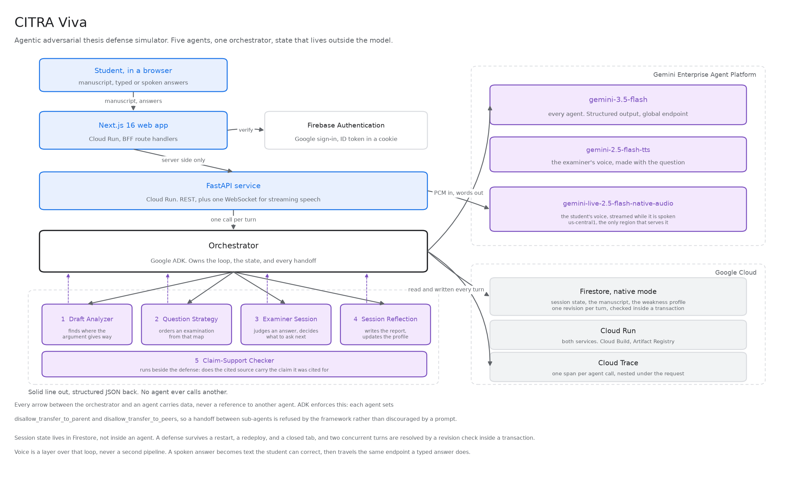
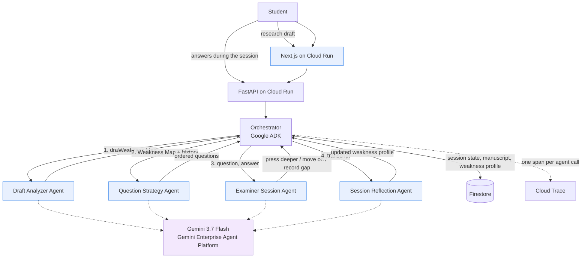

# CITRA Viva

**An agentic adversarial thesis defense simulator.** Five agents run a defense: one maps where the argument gives way, one plans an examination from that map, one judges each answer and decides what to say next, one writes the report from the transcript, and one runs beside them on citations.

The agent never answers for the student. It reads, it plans, it presses, and it records. Every question it asks is anchored to a line the student actually wrote.

A companion to [C.I.T.R.A](https://citra.eziedutech.dev) (Core Integrity and Trustworthy Research Assistant).

Built for the **All Things Agentic Hackathon** (Google and Devpost), category *Collaborative Partner*.

| | |
|---|---|
| **Try it** | https://citra-viva-web-40911677848.asia-southeast2.run.app |
| **Guide, no sign-in needed** | https://citra-viva-web-40911677848.asia-southeast2.run.app/panduan |
| **API and interactive docs** | https://citra-viva-api-40911677848.asia-southeast2.run.app/docs |
| **Architecture diagram** | [docs/architecture-diagram.png](docs/architecture-diagram.png) |
| **Developed by** | [EZI Edutech Dev](https://www.eziedutech.dev/) |

---

## Table of contents

- [Submission summary](#submission-summary)
  - [Meeting the tech mandatories](#meeting-the-tech-mandatories)
  - [Testing instructions for judges](#testing-instructions-for-judges)
- [The problem](#the-problem)
- [What CITRA Viva does](#what-citra-viva-does)
  - [Why this is an agent system and not a chatbot](#why-this-is-an-agent-system-and-not-a-chatbot)
  - [The constraint that shapes everything](#the-constraint-that-shapes-everything)
- [Architecture](#architecture)
  - [The five agents](#the-five-agents)
  - [Separation of concerns is enforced, not requested](#separation-of-concerns-is-enforced-not-requested)
  - [Technology](#technology)
- [Spin-up instructions](#spin-up-instructions)
  - [1. Prerequisites](#1-prerequisites)
  - [2. Authenticate](#2-authenticate)
  - [3. Configure](#3-configure)
  - [4. Install dependencies](#4-install-dependencies)
  - [5. Run the tests](#5-run-the-tests)
  - [6. Analyze the sample draft with the real model](#6-analyze-the-sample-draft-with-the-real-model)
  - [7. Run a full mock defense from the terminal](#7-run-a-full-mock-defense-from-the-terminal)
  - [8. Run the API](#8-run-the-api)
  - [9. Run the web app](#9-run-the-web-app)
  - [10. Deploy to Cloud Run](#10-deploy-to-cloud-run)
  - [11. Set up sign-in](#11-set-up-sign-in)
  - [12. Drive a full defense against the deployed service](#12-drive-a-full-defense-against-the-deployed-service)
- [The Draft Analyzer Agent](#the-draft-analyzer-agent)
- [The Question Strategy Agent](#the-question-strategy-agent)
- [The Examiner Session Agent](#the-examiner-session-agent)
- [The Session Reflection Agent](#the-session-reflection-agent)
- [Scoring a defense](#scoring-a-defense)
- [The Claim-Support Checker](#the-claim-support-checker)
- [Voice](#voice)
- [Cross-session memory](#cross-session-memory)
- [Reading an uploaded manuscript](#reading-an-uploaded-manuscript)
- [The web interface](#the-web-interface)
- [Identity, and who may open a session](#identity-and-who-may-open-a-session)
- [State, concurrency, and failure tolerance](#state-concurrency-and-failure-tolerance)
- [Observability](#observability)
- [Repository layout](#repository-layout)
- [Disclosure](#disclosure)
- [Developed by](#developed-by)
- [License](#license)

---

## Submission summary

| Field | Answer |
|---|---|
| **Category** | Collaborative Partner |
| **Model** | `gemini-3.7-flash`, on the Gemini Enterprise Agent Platform (formerly Vertex AI) |
| **Google agent framework** | **Google ADK** and the **Google GenAI SDK** |
| **Google Cloud services** | Cloud Run, Firestore, Firebase Authentication, Cloud Trace, Cloud Build, Artifact Registry |
| **Additional Google AI models** | `gemini-2.5-flash-tts` for the examiner's voice, `gemini-live-2.5-flash-native-audio` for streaming the student's while it is spoken, `gemini-3.5-flash` for transcribing a whole recording where streaming is unavailable |
| **Project started** | 20 August 2026, inside the submission period. Planning and architecture first, so the first commit is dated 24 August |
| **Hosted** | Yes, both the web app and the API |
| **Repository** | Public |

### Meeting the tech mandatories

Compliance with the three the rules require: Gemini 3.5 or newer, at least one Google agent framework, and at least one Google Cloud service. Each is met twice over, and the two columns are not the same claim. One is what the running product is made of. The other is what was used to build it, which for the cloud services is not a figure of speech: no deployable artifact was ever produced on a local machine.

| Google technology | Used while building it | Used inside the application |
|---|---|---|
| **Gemini 3.7 Flash** | Prompts were tuned against the live model through `scripts/run_draft_analyzer.py`, `scripts/run_viva_session.py`, and four gated live test files. A prompt cannot be developed against anything but real output | The reasoning behind all five agents. Structured JSON, global endpoint |
| **Gemini 2.5 Flash TTS** | Measured directly, which is how a phrase in our own prompt was found to be making the voice read at 13.7 seconds where 8.1 was correct | The examiner's voice, synthesised alongside the question rather than after it |
| **Gemini Live 2.5 Flash Native Audio** | Four of its behaviours were established by testing rather than documentation, including that automatic turn detection silently truncates a long answer | Streaming transcription of a spoken answer, over a WebSocket, while it is being spoken |
| **Gemini 3.5 Flash** | Established by direct test that it reads inline audio through `types.Part.from_bytes`, verbatim and complete on a 22 second recording, which is what made it safe to depend on as the fallback | Transcribes a whole uploaded recording. The path taken when a browser cannot open an audio context at 16 kHz, which is most of them |
| **Google ADK** | The framework that enforced the architecture while it was being written. The no-handoff rule is an ADK flag, held in place by 24 tests on every change, and `scripts/run_adk_agent.py` exists solely to prove the ADK path runs end to end against the live model | Declares all five agents as `LlmAgent` with a bound `output_schema`, and refuses transfer between them |
| **Google GenAI SDK** | Drove every development script and live test that called the model | The serving path. The FastAPI service calls the same prompts and schemas through `google-genai` |
| **Cloud Build** | Literally the build system. 44 builds. There is no local Docker step in this project at all | Not at runtime |
| **Artifact Registry** | 42 images produced during development | The source of the images Cloud Run serves |
| **Cloud Run** | 42 revisions deployed while building, each one a real deployment rather than a local server | Hosts the FastAPI service and the Next.js web app as two independent containers |
| **Firestore** | Used during development to prove that two concurrent turns cannot overwrite each other, against the real database rather than a fake | Every piece of state: the session, the manuscript, the weakness profile carried between sessions |
| **Firebase Authentication** | The sign-in provider and web app were created and configured as part of building | Verifies every ID token and decides who may open a session |
| **Cloud Trace** | Used to verify the reasoning chain, by reading a real trace back out rather than assuming the export worked | One span per agent call, nested under the request |

**Naming.** Gemini Enterprise Agent Platform, formerly Vertex AI. The SDK identifiers still spell it `vertexai` and `aiplatform`, and are reproduced as typed.

**ADK and the GenAI SDK.** ADK declares the agents and enforces their isolation. The GenAI SDK serves the requests.

### Testing instructions for judges

The application is free to use and requires no credentials from us.

1. Open https://citra-viva-web-40911677848.asia-southeast2.run.app
2. Sign in with **any Google account**. Sign-in exists because a session holds somebody's unpublished manuscript, and a session id should not be the only thing protecting it. Nothing else is required, and nothing is charged.
3. Paste a draft, or upload a PDF or DOCX. A sample draft is in the repository at [`codes/backpy/tests/fixtures/sample_draft_en.txt`](codes/backpy/tests/fixtures/sample_draft_en.txt), with an Indonesian one beside it.
4. The guide at [`/panduan`](https://citra-viva-web-40911677848.asia-southeast2.run.app/panduan) is public and needs no sign-in.

To see the agents work without the interface at all, the fastest route is [step 7](#7-run-a-full-mock-defense-from-the-terminal): one command takes a raw draft to a closing report against the live model.

To check this README rather than read it, run [`scripts/prove.py`](scripts/prove.py). It proves each claim in order and prints the real result: the model in use, that all five agents are ADK agents with transfer refused both ways, the four defense agents running live on a real draft, the citation checker, the 4.00 indicator computed from the transcript they just produced, the revisions serving traffic, and the reasoning chain read back out of Cloud Trace. It runs from any directory in any shell, and puts itself into the backend's environment rather than asking you to.

```bash
python scripts/prove.py --trace
```

---

<div align="right"><a href="#table-of-contents">&#8593; Contents</a></div>

## The problem

A thesis defense is the most consequential hour in a student's research life, and almost nothing exists to help them prepare for it. What is available is static, generic question banks that have never read the student's actual manuscript and never react to the quality of an answer.

Students therefore walk into their defense having never been tested on the real weak point of their argument, which is precisely where the examiner will aim.

<div align="right"><a href="#table-of-contents">&#8593; Contents</a></div>

## What CITRA Viva does

1. **Reads the full research draft** before the session begins: research question, methodology, findings, stated limitations.
2. **Builds a Weakness Map**, a synthesis nobody has written down before, locating the points where a skeptical examiner would press hardest.
3. **Plans an examination** from that map, ordered so the session builds rather than wanders.
4. **Runs it adaptively.** A strong answer earns a harder follow-up on the next gap. A weak answer earns a chance to clarify before it is recorded as a gap.
5. **Speaks and listens.** The examiner's question is spoken as it appears. A spoken answer is transcribed while it is being said.
6. **Remembers across sessions.** The second mock defense targets the weaknesses left unfixed after the first.

### Why this is an agent system and not a chatbot

A chatbot answers what it is asked. This system decides what to ask.

The loop is: read the draft, identify the weaknesses, plan an interrogation, listen to an answer, judge it, decide what to do next, and update a profile that changes the next session. The student never picks a question from a list. The system picks, from evidence it gathered itself, and it changes that choice based on how the student performs.

It also mutates data rather than reading it. A manuscript goes in as unstructured prose. What comes out is a structured Weakness Map, an ordered examination plan, a judged transcript, and a persistent weakness profile. None of those existed before the system built them.

### The constraint that shapes everything

**The agent never writes the student's argument for them.** It asks, it challenges, and it records. It never supplies the defense.

That is inherited from CITRA's *Integrity First* principle, and it is enforced in the schema rather than left to good intentions: there is no "suggested fix" field and no "replacement sentence" field anywhere in the Weakness Map. There is no pass mark, and no judgement of the research itself. A session does end with an indicator on the 4.00 scale, and the distinction that makes it defensible is that it scores the defense rather than the thesis, and that it is computed from the record rather than asked of a model. See [Scoring a defense](#scoring-a-defense).

The same rule decided a feature that was proposed and refused. Answer recommendations, behind a button, would have been easy to build and would have destroyed the product: a student who can see a suggested answer before replying is not defending anything. What shipped instead is the marking scheme. The student may reveal what a good answer *would need to contain*, never what to say, and the reveal is recorded in the transcript so it appears in the report.

---

<div align="right"><a href="#table-of-contents">&#8593; Contents</a></div>

## Architecture



<details>
<summary>The same diagram as Mermaid source</summary>



</details>

A longer discussion of the design decisions is in [docs/architecture.md](docs/architecture.md).

### The five agents

| Agent | Input | Output | The decision it owns | Status |
|---|---|---|---|---|
| **Draft Analyzer** | Full manuscript text | Weakness Map, every finding quoted | Where the argument gives way | Implemented and tested |
| **Question Strategy** | Weakness Map, prior weakness profile | Ordered questions, each anchored to a finding | What to ask, and in what order | Implemented and tested |
| **Examiner Session** | One question, one answer | A judgement and the next move | Press deeper, clarify, move on, or record a gap | Implemented and tested |
| **Session Reflection** | The full transcript | Closing report and profile adjustments | What the student should work on next | Implemented and tested |
| **Claim-Support Checker** | A claim and its cited source | Whether the source carries the claim | Runs beside the defense, not inside it | Implemented and tested |

Asking and judging are deliberately one agent. A follow-up question that does not arise from the judgement of the previous answer is just another question, and the entire premise of the product is that it is not.

A full mock defense goes from raw draft text to a closing report in one command. PDF, DOCX, and plain text are accepted.

### Separation of concerns is enforced, not requested

**Sub-agents never call one another.** Every exchange goes through the Orchestrator and through state in Firestore. This is enforced at the framework level rather than by convention: every agent sets `disallow_transfer_to_parent` and `disallow_transfer_to_peers`, so ADK itself refuses a handoff between them. The Question Strategy Agent receives a Weakness Map as data, never a reference to the agent that produced it.

The practical value is containment. A misbehaving agent cannot recruit another one. If the Draft Analyzer returns something malformed, the Orchestrator sees it and the failure stops there.

### Technology

| Component | Choice |
|---|---|
| Model | `gemini-3.7-flash` on **Gemini Enterprise Agent Platform** (formerly Vertex AI), global endpoint |
| Agent framework | **Google ADK** for the agent definitions, **Google GenAI SDK** for the serving path |
| Backend | Python 3.12, FastAPI, Pydantic v2, managed with `uv` |
| Frontend | Next.js 16, React 19, Tailwind 4, TypeScript |
| Sign-in | Firebase Authentication, Google provider |
| Database | Firestore, native mode, optimistic concurrency through a revision check inside a transaction |
| Manuscript storage | Firestore, in a document of its own with ownership on the record |
| Examiner's voice | `gemini-2.5-flash-tts` |
| Student's voice | `gemini-live-2.5-flash-native-audio`, streamed over a WebSocket |
| Deployment | Cloud Run, two services, built by Cloud Build into Artifact Registry |
| Observability | OpenTelemetry to Cloud Trace, one span per agent call, nested under the request |
| Tests | pytest, 244 passing offline, including failure-path tests, plus 4 live tests skipped by default |

---

<div align="right"><a href="#table-of-contents">&#8593; Contents</a></div>

## Spin-up instructions

Everything below has been run on a clean machine. No credential is hardcoded anywhere in the source, and `.env` is never committed.

### 1. Prerequisites

- Python 3.12 or newer
- [`uv`](https://docs.astral.sh/uv/)
- [Node.js 20 or newer](https://nodejs.org) and [`pnpm`](https://pnpm.io), for the web app
- [Google Cloud SDK](https://cloud.google.com/sdk/docs/install) (`gcloud`)
- A Google Cloud project with billing enabled

### 2. Authenticate

```bash
gcloud auth login
```

```bash
gcloud auth application-default login
```

```bash
gcloud services enable aiplatform.googleapis.com firestore.googleapis.com --project=YOUR_PROJECT_ID
```

### 3. Configure

```bash
cd codes/backpy && cp .env.example .env
```

Open `.env` and set one value at minimum: `GOOGLE_CLOUD_PROJECT`. Every variable in that file is named and documented, and the ones that are secret are left blank for you to fill in.

Leave `GOOGLE_CLOUD_LOCATION` at `global`. Recent Gemini models are served from the global endpoint first, so a regional value such as `us-central1` fails with `404 NOT_FOUND` for a model that has not been regionalized yet. The one exception is the live audio model, which carries its own location because it is served only from `us-central1`.

### 4. Install dependencies

```bash
cd codes/backpy && uv sync
```

The ADK layer ships as an optional extra. Install it to run the agent tests and the live ADK check:

```bash
cd codes/backpy && uv sync --extra adk
```

Run one agent through the framework end to end, against the live model:

```bash
cd codes/backpy && uv run python ../../scripts/run_adk_agent.py --agent draft_analyzer
```

### 5. Run the tests

```bash
cd codes/backpy && uv run pytest
```

The unit tests run **fully offline** against a fake model: no credentials, no network, no cost. They test our code, not the provider's weather. Live tests exist and are skipped by default.

### 6. Analyze the sample draft with the real model

```bash
cd codes/backpy && uv run python ../../scripts/run_draft_analyzer.py tests/fixtures/sample_draft_id.txt
```

The sample draft is in Indonesian on purpose. Findings come back in the language of the draft, which is what a defense in an Indonesian university actually needs. An English draft is in `tests/fixtures/sample_draft_en.txt`.

### 7. Run a full mock defense from the terminal

Interactive, you answer as the student:

```bash
cd codes/backpy && uv run python ../../scripts/run_viva_session.py tests/fixtures/sample_draft_id.txt
```

Scripted, so a recording is repeatable. The student side is fixed and the examiner side is the live model:

```bash
cd codes/backpy && uv run python ../../scripts/run_viva_session.py tests/fixtures/sample_draft_id.txt --answers tests/fixtures/scripted_answers_id.json
```

Simulate a second defense that remembers the first, by passing gaps the student left unresolved:

```bash
cd codes/backpy && uv run python ../../scripts/run_viva_session.py tests/fixtures/sample_draft_id.txt --gaps "generalisasi berlebihan ke populasi yang lebih luas"
```

### 8. Run the API

```bash
cd codes/backpy && uv run uvicorn app.main:app --reload --port 8080
```

Interactive documentation at http://localhost:8080/docs.

```bash
curl -X POST http://localhost:8080/api/sessions/prepare -H "Content-Type: application/json" -d "{\"draft_text\":\"your research draft text here\"}"
```

`/api/drafts/analyze` runs the Draft Analyzer alone. `/api/sessions/prepare` runs the full preparation chain: analyze the draft, then plan the examination that follows from it.

### 9. Run the web app

```bash
cd codes/frontnext && pnpm install && cp .env.example .env.local
```

```bash
cd codes/frontnext && pnpm dev
```

It expects the API at `CITRA_API_BASE_URL`, which defaults to the deployed service. Point it at `http://localhost:8080` to develop against a local backend. Leave the Firebase values blank and set `AUTH_REQUIRED=false` on the API to run without sign-in.

### 10. Deploy to Cloud Run

```bash
gcloud services enable run.googleapis.com cloudbuild.googleapis.com artifactregistry.googleapis.com aiplatform.googleapis.com firestore.googleapis.com cloudtrace.googleapis.com telemetry.googleapis.com --project=YOUR_PROJECT_ID
```

```bash
gcloud firestore databases create --location=asia-southeast2 --type=firestore-native --project=YOUR_PROJECT_ID
```

The Cloud Run service account needs to reach Gemini and Firestore. Grant it both, replacing `PROJECT_NUMBER` with the number from `gcloud projects describe YOUR_PROJECT_ID`:

```bash
gcloud projects add-iam-policy-binding YOUR_PROJECT_ID --member="serviceAccount:PROJECT_NUMBER-compute@developer.gserviceaccount.com" --role="roles/aiplatform.user"
```

```bash
gcloud projects add-iam-policy-binding YOUR_PROJECT_ID --member="serviceAccount:PROJECT_NUMBER-compute@developer.gserviceaccount.com" --role="roles/datastore.user"
```

Deploy the API:

```bash
cd codes/backpy && gcloud run deploy citra-viva-api --source . --region=asia-southeast2 --allow-unauthenticated --memory=1Gi --timeout=600 --set-env-vars="GOOGLE_CLOUD_PROJECT=YOUR_PROJECT_ID,GOOGLE_CLOUD_LOCATION=global,GOOGLE_GENAI_USE_VERTEXAI=true,GEMINI_MODEL=gemini-3.7-flash,GEMINI_VOICE_MODEL=gemini-2.5-flash-tts,GEMINI_LIVE_MODEL=gemini-live-2.5-flash-native-audio,GEMINI_LIVE_LOCATION=us-central1"
```

Then the web app, pointing at the API URL the previous command printed:

```bash
cd codes/frontnext && gcloud run deploy citra-viva-web --source . --region=asia-southeast2 --allow-unauthenticated --memory=1Gi --set-env-vars="CITRA_API_BASE_URL=YOUR_API_URL"
```

Finally, tell the API which web origin may open the streaming speech socket:

```bash
gcloud run services update citra-viva-api --region=asia-southeast2 --update-env-vars="ALLOWED_WEB_ORIGINS=YOUR_WEB_URL"
```

No secret is passed on any of those command lines. The services reach Gemini and Firestore through their own service identity, so there is no key file anywhere in the deployment.

### 11. Set up sign-in

Firebase has to be attached to your Google Cloud project through the console. The terms must be accepted by a person, and enabling the Google provider is what creates the OAuth client, which no API will do for you.

1. In the [Firebase console](https://console.firebase.google.com), create a project, then use **Add Firebase to Google Cloud project** at the bottom of the page and pick your existing project. This does not create a second project.
2. **Authentication, then Sign-in method, then Google, then Enable**.
3. **Authentication, then Settings, then Authorized domains**, and add your Cloud Run web domain.

The rest is scriptable. Create a web app and read its config:

```bash
curl -X POST -H "Authorization: Bearer $(gcloud auth print-access-token)" -H "x-goog-user-project: YOUR_PROJECT_ID" -H "Content-Type: application/json" -d "{\"displayName\":\"CITRA Viva Web\"}" "https://firebase.googleapis.com/v1beta1/projects/YOUR_PROJECT_ID/webApps"
```

```bash
curl -H "Authorization: Bearer $(gcloud auth print-access-token)" -H "x-goog-user-project: YOUR_PROJECT_ID" "https://firebase.googleapis.com/v1beta1/projects/YOUR_PROJECT_ID/webApps/YOUR_APP_ID/config"
```

Put those four values into the web service as `FIREBASE_API_KEY`, `FIREBASE_AUTH_DOMAIN`, `FIREBASE_PROJECT_ID`, and `FIREBASE_APP_ID`, and set `AUTH_REQUIRED=true` plus `FIREBASE_PROJECT_ID` on the API service.

None of those four is a secret. A Firebase web API key identifies the project to Google's endpoints and authorises nothing on its own, which is exactly why access is enforced by verifying ID tokens in the backend rather than by hiding a key. They are deliberately **not** `NEXT_PUBLIC_` variables: those are frozen into the bundle at build time, while Cloud Run supplies environment to the running container, so the config would be empty in production and correct only on a developer machine.

### 12. Drive a full defense against the deployed service

With `AUTH_REQUIRED=true`, these calls need a Firebase ID token in an `Authorization: Bearer` header. Against a local backend with authentication off, they work as written:

```bash
curl -s -X POST http://localhost:8080/api/sessions/start -H "Content-Type: application/json" -d "{\"draft_text\":\"your research draft text here\"}"
```

Then answer, using the `session_id` the previous call returned:

```bash
curl -s -X POST http://localhost:8080/api/sessions/SESSION_ID/answer -H "Content-Type: application/json" -d "{\"answer\":\"your defense\"}"
```

Repeat until the response reports `"finished": true`, then close the session to get the report:

```bash
curl -s -X POST http://localhost:8080/api/sessions/SESSION_ID/close
```

---

<div align="right"><a href="#table-of-contents">&#8593; Contents</a></div>

## The Draft Analyzer Agent

Input: research draft text. Output: a **Weakness Map**, a list of the points an examiner will attack, each one anchored to a verbatim quote from the manuscript.

### The four categories

| Category | Meaning |
|---|---|
| `unsupported_claim` | An assertion presented as established without data, citation, or reasoning strong enough to carry it |
| `causal_language_non_experimental` | Causal verbs applied to a design that cannot support causal inference |
| `overgeneralization` | Conclusions stretched beyond the sample, setting, period, or population actually studied |
| `unaddressed_limitation` | A limitation the examiner will obviously raise that the draft never acknowledges |

### Quote verification: a finding without evidence does not ship

A model can invent a sentence the author never wrote. In a practice defense that means **accusing a student over words that are not theirs**, which is a far more expensive failure than missing one weakness. Every finding therefore has to survive validation before anything downstream may use it:

1. A finding with no explanation or no quote is **dropped**, never backfilled with placeholder text.
2. Quotes are matched against the manuscript. Small transcription differences are **snapped back** to the original sentence; anything that cannot be recovered is **dropped**.
3. A category outside the enum is **neutralized to `other`**. The message stays useful, only the label is untrustworthy.
4. An unrecognized severity **falls to `low`**, never rises. Alarming an author about something nobody asserted is the more expensive mistake.
5. Duplicate quotes are dropped, and findings are ordered by how hard an examiner is likely to press.

Every rejected finding is **recorded with its reason** in the `dropped` field rather than disappearing quietly. An auditable system has to be able to explain what the model said and we refused.

### What is deliberately absent

- No pass/fail verdict and no mark for the research. Only individual findings, each tied to evidence. The 4.00 indicator produced at the end of a session scores how the defense went, and is computed from the transcript rather than asked of a model.
- No "suggested fix" field. The agent states what is weak and what must be defended, never the defense itself.
- No mechanical citation verification (Crossref or OpenAlex DOI matching). That module belongs to a separate project outside this hackathon and is deliberately out of scope.

---

<div align="right"><a href="#table-of-contents">&#8593; Contents</a></div>

## The Question Strategy Agent

Input: a Weakness Map. Output: an ordered examination plan, five to eight questions including an opening and a closing.

### Every question is anchored to a finding

The Draft Analyzer had to prove each finding against the manuscript. This agent has to prove each question against the Weakness Map. A probing question that cites no finding, or cites one that does not exist, is **dropped with its reason recorded**. The reason is the same in both cases: when a student asks why they were asked something, "the model felt like it" is not an answer a research integrity tool can give.

Opening and closing questions address the work as a whole and are the only ones allowed to stand without an anchor. An unrecognized question type falls back to `probe`, which deliberately keeps it inside the anchoring requirement rather than letting an unknown label become a loophole.

In the interface, each question shows the passage it came from. The student can see, at any moment, which line of their own manuscript put them in this position.

### Memory changes the order, not the content

When prior-session gaps are supplied, questions attacking them are asked first even when their finding carries lower severity. A weakness the student already failed to fix once is the most valuable thing to test again.

Whether a question addresses a previously recorded gap is a semantic judgment that cannot be proven from text, so the model may assert it and a lexical check offers a second route to the same conclusion. The part that *is* verifiable is enforced strictly: with no prior gaps supplied, nothing can be targeting one, whatever the model claims. The flag only affects ordering, so being wrong costs a position in the sequence rather than a false accusation.

### The rubric is not an answer

Each question carries `evaluation_criteria`, describing what the Examiner Session Agent should listen for when judging a reply. It is written as things to check for, never as a model answer.

The student may reveal it, deliberately, from a button. That is the compromise that replaced answer recommendations: it says what a good answer would need to *contain*, never what to say, and every reveal is recorded in the transcript so it appears in the closing report. Help that hides itself from the record is not help, it is a way to arrive at a real defense believing you were ready.

---

<div align="right"><a href="#table-of-contents">&#8593; Contents</a></div>

## The Examiner Session Agent

Input: one question and one answer. Output: a judgment and a decision about what happens next.

| Decision | When |
|---|---|
| `press_deeper` | The answer held. A student who defends well earns a harder question, not a pass. |
| `ask_clarification` | The answer was weak or evasive, but may have been badly expressed. One chance to say it properly. |
| `move_on` | The point is settled, or pressing again would only repeat what is established. |
| `record_gap` | The student had a fair chance and the point is still undefended. |

### Two rules the prompt is not trusted to keep

A prompt is a request, not a guarantee, so both of these are enforced in code and every override is recorded:

**A gap cannot be recorded before the student has been offered a clarification.** Giving up the first time someone stumbles is ambush, not examination. When the model reaches for `record_gap` too early, the decision is downgraded and the gap note is cleared with it.

**One question cannot swallow the session.** Follow-ups are capped, and a second request for clarification on a point already clarified becomes a recorded gap rather than an infinite loop.

Unknown enum values fall to the option that cannot harm the student: an unrecognized strength becomes `partial` rather than `weak`, and an unrecognized decision becomes `ask_clarification`, which neither abandons the point nor logs a weakness.

### State lives outside the agent

The session loop is in the Orchestrator, not in the agent. Every turn reads the entire session from storage and writes it back, so the process holds nothing between turns. A server restart mid-defense costs the student their place in the conversation and nothing else, and the API scales horizontally without sticky sessions.

---

<div align="right"><a href="#table-of-contents">&#8593; Contents</a></div>

## Scoring a defense

A session ends with an indicator on the **4.00 scale**, the one most faculties use. The product still refuses to grade research, and that rule survives here because of where the number comes from.

**The model never produces a score.** Every input was already written into the session while the defense was running: how each answer was judged, how many times the student was pressed, whether a clarification was offered, whether the marking scheme was revealed, and whether the point ended undefended. This is arithmetic on that record and nothing else.

Three properties follow, and they are the entire reason for doing it this way.

| | |
|---|---|
| **Reproducible** | The same transcript gives the same number, on any machine, with no model call |
| **Traceable** | Every point can be pointed at a specific judged answer |
| **Checkable** | The workings travel with the total, so a student argues with a line rather than with a figure |

Questions are weighted by the severity of the finding they attacked. Severity is documented throughout this project as a claim about how hard an examiner will press, never about the quality of the work, so a high severity question counts for more because failing to defend an obvious attack matters more.

**Advice is derived the same way.** Each line counts something the examiner recorded, so all of it can be found in the transcript. It is returned as codes and counts rather than sentences, because the sentence has to be in the language the student is reading and the scoring layer has no business deciding that. A defense that held throughout is told so, rather than given something invented to improve.

**Pasting is recorded and never scored.** Blocking paste is unenforceable, and it would stop the legitimate case: quoting your own manuscript to defend a point is what a good answer does. Deducting for it would punish that same case. So the count is kept, shown at the end with the note that it costs nothing, and left out of the arithmetic. There is nobody to deceive here anyway, since the report is private to the student who wrote it. The risk is arriving at a real defense believing you were ready, and the remedy for that is a record rather than a lock.

Implemented in [`codes/backpy/app/scoring/assessment.py`](codes/backpy/app/scoring/assessment.py), with 30 tests whose arithmetic is worked out by hand rather than copied from a run.

---

<div align="right"><a href="#table-of-contents">&#8593; Contents</a></div>

## The Session Reflection Agent

Input: a finished transcript. Output: what held, what is still undefended, and the recurring habits behind the gaps.

**The summary cannot contradict its own transcript, in either direction.** Both are reconciled against what the examiner actually recorded during the session, and every correction is logged.

*Understating* is the more dangerous direction and is checked first. A point the examiner marked as satisfied cannot vanish from `strong_points`. This is not hypothetical: a live run produced a report saying nothing held while the transcript recorded two answers judged strong, and a student who is told nothing held will not trust the part of the report that says what did not.

*Overstating* is the other direction. If no answer held at all, a list of strengths is flattery, and flattery here is a false readiness signal.

Restoration always uses the examiner's own words, captured at the moment the point was conceded. Our code never writes prose crediting or blaming the student. When something held but the examiner never named what, the contradiction is logged rather than papered over.

`recurring_gap_patterns` is the field that makes the next session sharper than this one. It is written to be recognisable in a different manuscript months later, so "treats correlational findings as causal when writing conclusions" rather than "question 3 was weak".

The report downloads as a formatted PDF, with the logo, the indicator and its workings, and the full transcript. Markdown is offered alongside it, because the two are for different readers: one is handed to a supervisor, the other is pasted back into the next session.

---

<div align="right"><a href="#table-of-contents">&#8593; Contents</a></div>

## The Claim-Support Checker

A supporting layer, not one of the four defense sub-agents.

Mechanical citation verification, matching a DOI against Crossref or OpenAlex, belongs to a separate project and is **deliberately outside this submission**. It answers a different question anyway: whether the source exists and the metadata is real.

What runs here is the question a supervisor actually asks. The source exists, the DOI resolves, but does it carry the specific sentence it was cited for, or is it merely about the same topic? Topical relevance passes every mechanical check ever written, and it is the most common way a citation misleads.

Two rules are enforced in code, and both exist because this feature tells a student something about their own work:

**A verdict of support must point at the passage it rests on**, verified verbatim against the source text supplied. A model asserting support it cannot locate is precisely the failure this feature exists to catch, so it is not permitted to commit that failure itself. When it does, the verdict falls to `cannot_tell` and the reason is recorded.

**A verdict that a citation does not hold must come with a question for the author.** Marking a citation wrong with no way to answer is an accusation, and a student may have a reason no abstract could show. Without a question, that verdict also falls to `cannot_tell`.

Neither rule invents content. "We could not settle this from the text supplied" is an honest answer; a manufactured judgment is not.

Against the live model, the same source produces three different verdicts depending on how far the claim reaches: a causal claim gets `partially_supports` with the association-versus-cause gap named, an honestly worded claim still gets `partially_supports` because the source studied one country and one age band, and an off-topic claim gets `does_not_support` with a question rather than a verdict.

---

<div align="right"><a href="#table-of-contents">&#8593; Contents</a></div>

## Voice

A defense is spoken, so this one is too. Voice is a **layer over the text loop, never a second pipeline**, and that decision is what keeps every session rule applying equally to a spoken answer and a typed one.

**The examiner speaks as it appears.** The question's audio is synthesised inside the wait the student is already having, rather than after it. A turn that takes 20 seconds to judge comes back with 22 seconds of finished audio attached. There is no button and no second wait. When synthesis fails, the turn is unaffected: the text is there, and a button to play it by hand is still there.

**The student's answer is transcribed while they speak.** 16 kHz mono PCM is captured directly through the Web Audio API and streamed over a WebSocket in 100 millisecond frames to `gemini-live-2.5-flash-native-audio`. The complete transcript arrives under a second after they press stop, rather than four seconds after.

**The transcript lands in the answer box, not in the session.** The student reads it, corrects anything the recognition got wrong, and sends it deliberately. A defense transcript is a permanent record, and a word the model misheard must be correctable before it becomes part of one.

Four things about the Live API were established by testing rather than assumed, and each one is documented at the top of [`codes/backpy/app/speech/live.py`](codes/backpy/app/speech/live.py). The most costly: with automatic activity detection on, the API closes the turn at the first pause and treats everything said afterwards as an interruption. Four sentences went in and one came out. A student pausing for breath is not a student who has finished, and only the student knows when they have, so detection is off and the turn boundaries are sent explicitly.

---

<div align="right"><a href="#table-of-contents">&#8593; Contents</a></div>

## Cross-session memory

The second mock defense is not the first one repeated.

When a session closes, the Session Reflection Agent returns recurring gap patterns, and those are merged into a **weakness profile** held in Firestore against the student's account. The next examination reads that profile and moves questions attacking unfixed weaknesses to the front, even when their finding carries lower severity.

The managed Memory Bank service was examined and deliberately not adopted. It requires an Agent Engine resource, so using it would mean standing up infrastructure the product does not otherwise need. The deeper reason is that a free-form memory about a person is exactly the kind of unverifiable claim this product refuses everywhere else. The weakness profile is structured instead: every entry traces back to a specific finding in a specific manuscript, so it can be read, checked, and corrected.

---

<div align="right"><a href="#table-of-contents">&#8593; Contents</a></div>

## Reading an uploaded manuscript

PDF, DOCX, and plain text. The extracted text is **returned to the student and shown to them** rather than analysed straight away, and that is the whole design rather than a convenience.

Every finding must quote the draft verbatim, and every quote is verified against the text we were given. If extraction happened invisibly, those quotes would be checked against a version of the manuscript the student has never seen: a two column layout read in the wrong order, a running header repeated on every page, a ligature that arrived as a character they cannot type. They would be shown a quote they cannot find in their own document, and told an examiner will attack it.

So the text lands in an editable field. The student reads it, fixes anything extraction got wrong, and submits deliberately. What the analyzer reads is what they saw.

| Case | What happens |
|---|---|
| Scanned PDF with no text layer | Refused with "this PDF has no selectable text", not "your draft is too short", which would send a student hunting for a problem in their writing |
| Password protected PDF | Named as such. An empty password is tried, because it unlocks many "protected" files; nothing else is guessed |
| Running headers and page numbers | Removed when a short line repeats on more than half the pages, and the removal is reported. A line repeated across only two pages survives, because two pages is not evidence of a header |
| Tables in a DOCX | Kept. Methodology and results live in tables in most theses, and those are the sections an examiner presses hardest on |
| Hyphenated line breaks, ligatures | Normalised, so a quote does not contain characters the student cannot type |
| A file that is not what it claims | One readable sentence, never a stack trace about zip files |
| A draft beyond 400,000 characters | Refused by size, rather than accepted and silently truncated somewhere in the middle |

The uploaded file itself is read into memory and discarded, so no PDF or DOCX is ever written anywhere. What is stored is the text the student reviewed and chose to submit, in a Firestore document of its own with ownership recorded on the record.

It is stored rather than held for the length of a request because the student needs it during the defense. A question naming a passage is worth little if the manuscript it came from is in another window, so the room can open the submitted text beside the examination. That is also the copy every quote was verified against, which makes it the right copy to be reading.

---

<div align="right"><a href="#table-of-contents">&#8593; Contents</a></div>

## The web interface

Four surfaces: a public landing page, a workspace, the defense room, and a public guide.

```
+----------------------------------------------------------------+
| HEADER   CITRA Viva  ·  Pertanyaan 3 dari 7  ·  4 jawaban       |
+----------+---------------------------+-------------------------+
| SIDEBAR  |  DEFENSE ROOM             |  SLIDEOVER              |
| 240px    |                           |  380px                  |
|          |  Examiner asks            |  Weakness Map           |
| Q1 done  |  Student answers          |  Judgment of the answer |
| Q2 done  |  Examiner presses         |  Session report         |
| Q3 now   |                           |                         |
| Q4 lock  |  [answer box, sticky]     |  AI territory in purple |
+----------+---------------------------+-------------------------+
```

The interface follows the CITRA design system without reinterpreting it: blue is the human domain and purple marks every AI contribution, corners are square except buttons and chips, font weight never reaches 700, icons are inline SVG from one set, and emoji appear nowhere. Each of the three panels scrolls independently, so reading a finding on the right never moves the transcript in the middle.

While an agent is working, a contextual animation names which stage is running: extracting, reading, verifying, planning, judging, reporting, or checking a citation. A wait with no indicator is indistinguishable from a broken button.

Three decisions are worth naming.

**The browser never talks to the API.** Every call goes through a Next route handler, so the API URL is not shipped to the client, there is no CORS to configure, and the API can be locked down later without touching the interface. The one exception is the streaming speech socket, because a route handler cannot carry a WebSocket upgrade, and it is handled deliberately: the credential travels in the subprotocol rather than in a query string that proxies and logs would keep.

**Nothing about a session lives in the tab.** The room reads its state from the server on every visit, which is what makes a refresh mid-defense harmless. That mirrors the backend rule: the session lives in Firestore, not in a process or a page.

**The boundary is treated as untrusted even though it is our own service.** A session created by an older API revision came back without its Weakness Map and took the whole room to an error page over one missing array. During a real defense that is the worst possible trade, so missing fields are now filled in at the boundary. A panel with nothing in it is a bad panel; a blank screen is a broken product.

---

<div align="right"><a href="#table-of-contents">&#8593; Contents</a></div>

## Identity, and who may open a session

A session carries a student's manuscript and the map of where their argument gives way. Before sign-in existed, a guessed session id was enough to read both. For a product whose premise is research integrity that is not a missing feature, it is a contradiction, so it is closed.

**Firebase ID tokens, verified against Google's public keys.** The backend verifies every token before trusting a single claim in it, and keys ownership on the Firebase subject rather than the email, because an email can change hands and a subject cannot.

**A session can only be opened by the account that created it.** The refusal is `404`, not `403`. Telling a stranger that a session exists but is not theirs confirms the id is real, which is the one useful thing an id guesser could learn.

**The comparison has no exemption for a session with no owner.** An earlier version let those through, so that sessions predating authentication would not be orphaned by it. That was affordable only while nobody real had used the service. The moment every visitor signs in, an ownerless document is one that anyone who guesses its id can open, and what it holds is somebody's unpublished manuscript. The loophole is closed, including for anyone who only wants to try the demo.

**A session can be deleted, and deletion is real.** The session document and the manuscript stored with it are both removed, permanently, with no archive and no recovery on our side. The ownership check is the same one that guards reading, reused rather than reimplemented, and the manuscript is deleted first: if only one of the two can happen, the student's unpublished thesis is the one that must not survive.

**The token never reaches any script on the page.** After sign-in the browser posts it to a route handler that stores it in an HttpOnly cookie, and everything else reads it from there: server rendered pages, route handlers, and the calls they forward. An injected script cannot read it, the session page can still render on the server, and no component has to remember to attach a header, which is how one endpoint ends up unauthenticated while the rest are fine.

`AUTH_REQUIRED=false` turns the whole check off, so the test suite and a bare local backend run without a Firebase project. Every deployment sets it explicitly, because with it off a session id is the only thing standing between a stranger and someone's manuscript.

---

<div align="right"><a href="#table-of-contents">&#8593; Contents</a></div>

## State, concurrency, and failure tolerance

**State lives outside the agent.** Session state is in Firestore, never in an agent's memory. A defense survives a restart, a redeploy, a closed tab, and a cold Cloud Run instance. It also means the reasoning loop is inspectable: the state of a session at any turn is a document you can read.

**Two concurrent turns cannot overwrite each other.** Every session record carries a revision number, and a write reads that revision inside a Firestore transaction and refuses if it has moved. Before this, two answers submitted at nearly the same moment would both succeed and one would quietly disappear. It was found by looking for it rather than by being reported, and it is now covered by a test that runs against real Firestore.

**Transient failures are absorbed.** Quota exhaustion and service-unavailable responses are retried with exponential backoff. A `429` in the middle of a defense must not end the defense.

**Persistence failures are non-fatal in the other direction.** If the analysis succeeds and the Firestore write fails, the analysis is still returned. A database hiccup should not throw away a result that is already in hand, least of all during a live demo.

**Failures that used to succeed quietly now refuse.** An audio format the model cannot read used to produce a confident and completely invented transcript rather than an error. A finding quoting text that does not exist in the manuscript used to reach the student. A draft of any size used to be accepted. Each of these now refuses, by name, with a sentence that says what went wrong.

The principle underneath all of it: *verify what can be verified, bound what cannot, and never let an unverifiable claim reach a place where being wrong would harm the student.*

---

<div align="right"><a href="#table-of-contents">&#8593; Contents</a></div>

## Observability

One span per agent call, exported to Cloud Trace, nested under the request that caused it. A single turn of a defense reads as one trace: the HTTP request, and inside it the agent that judged the answer, with how long it took and what it decided.

```
GET /api/sessions/prepare                         55.1s
   agent.draft_analyzer                           21.9s   findings_kept=5  findings_dropped=0  draft_characters=1915
   agent.question_strategy                        33.3s   questions_kept=6  questions_dropped=0  findings_in=5
```

That is a real trace, read back out of Cloud Trace rather than drawn for the README.

**Attributes carry counts, ids, and decisions. Never content.** No draft text, no answers, no transcripts. A trace is readable by anyone with console access to the project, which is a wider audience than the one a session is written for.

**Tracing never costs an answer.** It is off unless `ENABLE_CLOUD_TRACE` is set, and every failure path inside it degrades to no spans rather than to a failed request: a missing package, a missing project, an exporter that cannot reach Google. A student mid-defense does not lose a turn because telemetry broke.

**It also found the class of bug this project keeps meeting.** The obvious exporter, `CloudTraceSpanExporter` from `opentelemetry-exporter-gcp-trace`, is deprecated and fails in the worst available way: it accepts spans, raises nothing, logs nothing, and delivers nothing. It was only caught because the trace was read back afterwards instead of assumed. What works is OTLP over HTTP to the Telemetry API, with two details that are not guessable from an error message: the endpoint carries no project, and the project has to travel as a `gcp.project_id` resource attribute or the request is refused.

To turn it on for your own deployment:

```bash
gcloud services enable cloudtrace.googleapis.com telemetry.googleapis.com --project=YOUR_PROJECT_ID
```

```bash
gcloud projects add-iam-policy-binding YOUR_PROJECT_ID --member="serviceAccount:PROJECT_NUMBER-compute@developer.gserviceaccount.com" --role="roles/cloudtrace.agent"
```

```bash
gcloud run services update citra-viva-api --region=asia-southeast2 --update-env-vars="ENABLE_CLOUD_TRACE=true"
```

---

<div align="right"><a href="#table-of-contents">&#8593; Contents</a></div>

## Repository layout

```
codes/frontnext/                  Next.js web app
  src/app/                        pages, plus route handlers acting as the BFF
  src/components/                 app shell, defense room, slideover, icons
  src/lib/                        API client, audio capture, live socket, report export
codes/backpy/                     Python backend
  app/
    agents/draft_analyzer/        prompt.py, core.py (pure logic), adk_agent.py (ADK wrapper)
    agents/question_strategy/     same shape, one responsibility further down the chain
    agents/examiner_session/      judges one answer, decides what happens next
    agents/session_reflection/    turns a finished transcript into carry-forward patterns
    agents/claim_support/         does this source carry this specific claim?
    ingest/extract.py             PDF, DOCX, and text into reviewable text
    orchestrator/orchestrator.py  coordination between sub-agents
    api/routes.py                 FastAPI endpoints
    api/live_routes.py            the WebSocket a spoken answer streams into
    speech/voice.py               synthesis and whole-file transcription
    speech/live.py                the Live API session, and what testing established
    models/                       weakness_map.py, question_strategy.py, session.py
    storage/session_store.py      session persistence, Firestore and in-memory
    storage/draft_store.py        the manuscript, kept in its own document
    llm/client.py                 Gemini access through Agent Platform
    llm/adk_env.py                environment ADK reads for itself
    observability/tracing.py      one span per agent call, and nothing that can break a turn
    llm/retry.py                  backoff for quota and availability failures
    common/text.py                helpers shared by agents, so no agent imports another
    storage/firestore.py          the only module that talks to the database
    auth.py                       token verification and who the caller is
    config.py                     all configuration from environment variables
    main.py
  tests/                          offline tests, plus live tests skipped by default
  .env.example, Dockerfile, pyproject.toml
docs/                             architecture notes and the architecture diagram
scripts/                          tooling outside the application
  prove.py                        runs every claim in this README and prints what happened
```

---

---

<div align="right"><a href="#table-of-contents">&#8593; Contents</a></div>

## Disclosure

CITRA Viva was built entirely within the Submission Period for this hackathon, starting 20 August 2026. The first four days went to planning and architecture, which is why the first commit is dated 24 August. No pre-existing code was incorporated.

It is a companion to [C.I.T.R.A](https://citra.eziedutech.dev), an existing research integrity application by the same author, in pre-development status. The two share a design system and a name. They share no code, and nothing from that project was reused here. One module was deliberately kept out of scope for exactly this reason: basic mechanical citation verification against Crossref and OpenAlex already exists in that other project, so it is **not** part of this submission, in compliance with the New Projects Only rule.

Development used AI coding assistants, which the rules permit explicitly. Among them was Google Antigravity, running Gemini, used as an assistant while building this. It is named here as a tool that was used, not as an author: all architectural decisions, product decisions, and verification of what shipped are the author's own.

That is a separate matter from the frameworks this project is built on. The agent frameworks in the submission are Google ADK and the Google GenAI SDK, both of which can be pointed at line by line in this repository. Gemini models used through a coding assistant are not integrated into the product and are not claimed as such.

Third-party dependencies are the ones declared in [`codes/backpy/pyproject.toml`](codes/backpy/pyproject.toml) and [`codes/frontnext/package.json`](codes/frontnext/package.json), each used under its own open source licence. No third-party data source is used: the only data the system reads is the manuscript the student supplies.

<div align="right"><a href="#table-of-contents">&#8593; Contents</a></div>

## Developed by

**EZI Edutech Dev** — https://www.eziedutech.dev/

<div align="right"><a href="#table-of-contents">&#8593; Contents</a></div>

## License

[MIT](LICENSE)
