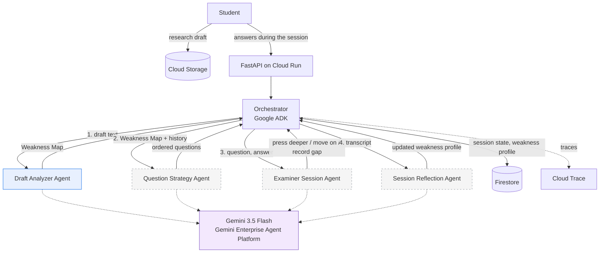

# CITRA Viva

**An adversarial AI thesis defense simulator.** A module of C.I.T.R.A (Core Integrity & Trustworthy Research Assistant).

Built for the **All Things Agentic Hackathon** (Google / Devpost), category *Collaborative Partner*.

---

## The problem

A thesis defense is the most consequential hour in a student's research life, and almost nothing exists to help them prepare for it. What is available is static, generic question banks that have never read the student's actual manuscript and never react to the quality of an answer.

Students therefore walk into their defense having never been tested on the real weak point of their argument, which is precisely where the examiner will aim.

## What CITRA Viva does

1. **Reads the full research draft** before the session begins: research question, methodology, findings, stated limitations.
2. **Builds a Weakness Map**, a synthesis nobody has written down before, locating the points where a skeptical examiner would press hardest.
3. **Runs an adaptive examination.** A strong answer earns a harder follow-up on the next gap. A weak answer earns a chance to clarify before it is recorded as a gap.
4. **Remembers across sessions.** The second mock defense targets the weaknesses left unfixed after the first.

This is not a question-and-answer chatbot. It is a reasoning loop: read the draft, identify weaknesses, plan an interrogation, listen to the answer, decide what to do next, update the student's weakness profile.

### The constraint that shapes everything

**The agent never writes the student's argument for them.** It asks, it challenges, and it records. It never supplies the defense.

That is inherited from CITRA's *Integrity First* principle, and it is enforced in the schema rather than left to good intentions: there is no "suggested fix" field and no "replacement sentence" field anywhere in the Weakness Map. There is also no pass/fail verdict and no research quality score, because a machine should not hand down a judgment it cannot trace to evidence.

---

## Architecture



Solid blue is implemented. Dashed grey is specified and not yet built. A longer discussion of the design decisions is in [docs/architecture.md](docs/architecture.md).

**Sub-agents never call one another.** Every exchange goes through the Orchestrator and through state in Firestore. On the Draft Analyzer this is enforced at the framework level, not by convention: `disallow_transfer_to_parent` and `disallow_transfer_to_peers` are both set, so ADK itself refuses a handoff to the Examiner Session Agent.

### Build status

| Sub-agent | Status |
|---|---|
| **Draft Analyzer Agent** | Implemented and tested |
| Question Strategy Agent | Specified, not yet built |
| Examiner Session Agent | Specified, not yet built |
| Session Reflection Agent | Specified, not yet built |

Draft input is plain text for now. PDF and DOCX parsing follows.

### Technology

| Component | Choice |
|---|---|
| Model | `gemini-3.5-flash` on **Gemini Enterprise Agent Platform** (formerly Vertex AI) |
| Agent framework | **Google ADK**, `google-cloud-aiplatform[agent_engines,adk]` |
| Backend | Python 3.12, FastAPI |
| Database | Firestore, native mode |
| Draft storage | Cloud Storage |
| Deployment | Cloud Run for the API, Agent Runtime for the ADK agent |
| Observability | OpenTelemetry to Cloud Trace |

---

## Running it locally

### 1. Prerequisites

- Python 3.12 or newer
- [`uv`](https://docs.astral.sh/uv/)
- Google Cloud SDK (`gcloud`)
- A Google Cloud project with the Agent Platform / Vertex AI API enabled

### 2. Authenticate

```bash
gcloud auth login
```

```bash
gcloud auth application-default login
```

```bash
gcloud services enable aiplatform.googleapis.com firestore.googleapis.com --project=YOUR_PROJECT_ID
```

### 3. Configure

```bash
cd codes/backpy && cp .env.example .env
```

Open `.env` and set two values at minimum: `GOOGLE_CLOUD_PROJECT` and `GOOGLE_CLOUD_LOCATION`. No credential is hardcoded anywhere in the source, and `.env` is never committed.

### 4. Install dependencies

```bash
cd codes/backpy && uv sync
```

The ADK layer is optional and only needed when deploying the agent to Agent Runtime:

```bash
cd codes/backpy && uv sync --extra adk
```

### 5. Run the tests

```bash
cd codes/backpy && uv run pytest
```

The unit tests run **fully offline** against a fake model: no credentials, no network, no cost. They test our code, not the provider's weather.

### 6. Analyze the sample draft with the real model

```bash
cd codes/backpy && uv run python ../../scripts/run_draft_analyzer.py tests/fixtures/sample_draft_id.txt
```

The sample draft is in Indonesian on purpose. Findings come back in the language of the draft, which is what a defense in an Indonesian university actually needs.

### 7. Run the API

```bash
cd codes/backpy && uv run uvicorn app.main:app --reload --port 8080
```

Interactive documentation at `http://localhost:8080/docs`.

```bash
curl -X POST http://localhost:8080/api/drafts/analyze -H "Content-Type: application/json" -d "{\"draft_text\":\"your research draft text here\"}"
```

### 8. Deploy to Cloud Run

```bash
cd codes/backpy && gcloud run deploy citra-viva-api --source . --region us-central1 --allow-unauthenticated
```

---

## The Draft Analyzer Agent

Input: research draft text. Output: a **Weakness Map**, a list of the points an examiner will attack, each one anchored to a verbatim quote from the manuscript.

### The four categories

| Category | Meaning |
|---|---|
| `unsupported_claim` | An assertion presented as established without data, citation, or reasoning strong enough to carry it |
| `causal_language_non_experimental` | Causal verbs applied to a design that cannot support causal inference |
| `overgeneralization` | Conclusions stretched beyond the sample, setting, period, or population actually studied |
| `unaddressed_limitation` | A limitation the examiner will obviously raise that the draft never acknowledges |

### Quote verification: a finding without evidence does not ship

A model can invent a sentence the author never wrote. In a practice defense that means **accusing a student over words that are not theirs**, which is a far more expensive failure than missing one weakness. Every finding therefore has to survive validation before anything downstream may use it:

1. A finding with no explanation or no quote is **dropped**, never backfilled with placeholder text.
2. Quotes are matched against the manuscript. Small transcription differences are **snapped back** to the original sentence; anything that cannot be recovered is **dropped**.
3. A category outside the enum is **neutralized to `other`**. The message stays useful, only the label is untrustworthy.
4. An unrecognized severity **falls to `low`**, never rises. Alarming an author about something nobody asserted is the more expensive mistake.
5. Duplicate quotes are dropped, and findings are ordered by how hard an examiner is likely to press.

Every rejected finding is **recorded with its reason** in the `dropped` field rather than disappearing quietly. An auditable system has to be able to explain what the model said and we refused.

### What is deliberately absent

- No pass/fail verdict and no research quality score. Only individual findings, each tied to evidence.
- No "suggested fix" field. The agent states what is weak and what must be defended, never the defense itself.
- No mechanical citation verification (Crossref/OpenAlex DOI matching). That module belongs to a separate project outside this hackathon and is deliberately out of scope.

---

## Repository layout

```
codes/backpy/                     Python backend
  app/
    agents/draft_analyzer/        prompt.py, core.py (pure logic), adk_agent.py (ADK wrapper)
    orchestrator/orchestrator.py  coordination between sub-agents
    api/routes.py                 FastAPI endpoints
    models/                       weakness_map.py, firestore_schemas.py
    llm/client.py                 Gemini access through Agent Platform
    storage/firestore.py          the only module that talks to the database
    config.py                     all configuration from environment variables
    main.py
  tests/                          offline tests, plus live tests skipped by default
  .env.example, Dockerfile, pyproject.toml
docs/                             architecture notes
scripts/                          tooling outside the application
```

---

## Disclosure

CITRA Viva and the Claim-Support Checker reasoning layer were built entirely during the Submission Period (August 2026), as a new module of CITRA, an independent research project in pre-development status. The basic mechanical citation verification module (Crossref/OpenAlex API matching), previously built outside this hackathon, is **not** part of this submission, in compliance with the New Projects Only rule.

## License

[MIT](LICENSE)
