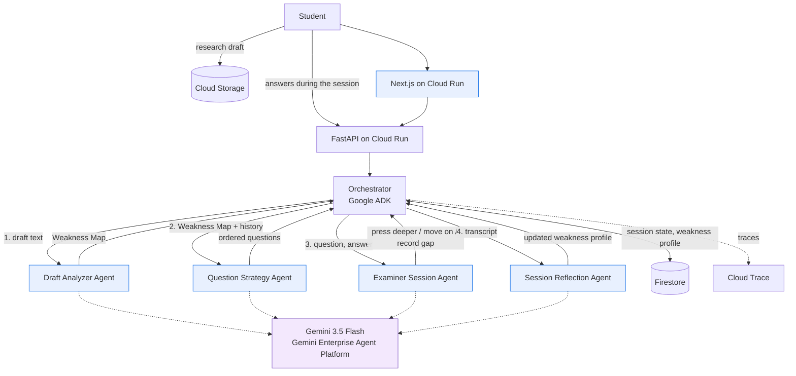

# CITRA Viva

**An agentic adversarial thesis defense simulator.** Four agents run a defense in order: one maps where the argument gives way, one plans an examination from that map, one judges each answer and decides what to say next, and one writes the report from the transcript. A fifth runs beside them, on citations.

A companion to C.I.T.R.A (Core Integrity & Trustworthy Research Assistant).

Built for the **All Things Agentic Hackathon** (Google / Devpost), category *Collaborative Partner*.

**Try it:** https://citra-viva-web-40911677848.asia-southeast2.run.app
**API:** https://citra-viva-api-40911677848.asia-southeast2.run.app/docs

---

## The problem

A thesis defense is the most consequential hour in a student's research life, and almost nothing exists to help them prepare for it. What is available is static, generic question banks that have never read the student's actual manuscript and never react to the quality of an answer.

Students therefore walk into their defense having never been tested on the real weak point of their argument, which is precisely where the examiner will aim.

## What CITRA Viva does

1. **Reads the full research draft** before the session begins: research question, methodology, findings, stated limitations.
2. **Builds a Weakness Map**, a synthesis nobody has written down before, locating the points where a skeptical examiner would press hardest.
3. **Runs an adaptive examination.** A strong answer earns a harder follow-up on the next gap. A weak answer earns a chance to clarify before it is recorded as a gap.
4. **Remembers across sessions.** The second mock defense targets the weaknesses left unfixed after the first.

This is not a question-and-answer chatbot. It is a reasoning loop: read the draft, identify weaknesses, plan an interrogation, listen to the answer, decide what to do next, update the student's weakness profile.

### The constraint that shapes everything

**The agent never writes the student's argument for them.** It asks, it challenges, and it records. It never supplies the defense.

That is inherited from CITRA's *Integrity First* principle, and it is enforced in the schema rather than left to good intentions: there is no "suggested fix" field and no "replacement sentence" field anywhere in the Weakness Map. There is also no pass/fail verdict and no research quality score, because a machine should not hand down a judgment it cannot trace to evidence.

---

## Architecture



A longer discussion of the design decisions is in [docs/architecture.md](docs/architecture.md).

**Sub-agents never call one another.** Every exchange goes through the Orchestrator and through state in Firestore. This is enforced at the framework level rather than by convention: every agent sets `disallow_transfer_to_parent` and `disallow_transfer_to_peers`, so ADK itself refuses a handoff between them. The Question Strategy Agent receives a Weakness Map as data, never a reference to the agent that produced it.

### Build status

| Sub-agent | Status |
|---|---|
| **Draft Analyzer Agent** | Implemented and tested |
| **Question Strategy Agent** | Implemented and tested |
| **Examiner Session Agent** | Implemented and tested |
| **Session Reflection Agent** | Implemented and tested |

All four sub-agents run, and a full mock defense goes from raw draft text to a closing report in one command. PDF, DOCX, and plain text are accepted. The Claim-Support Checker runs as a supporting layer alongside them.

### Technology

| Component | Choice |
|---|---|
| Model | `gemini-3.5-flash` on **Gemini Enterprise Agent Platform** (formerly Vertex AI) |
| Agent framework | **Google ADK**, `google-cloud-aiplatform[agent_engines,adk]` |
| Backend | Python 3.12, FastAPI |
| Frontend | Next.js 16, React 19, Tailwind 4, TypeScript |
| Sign-in | Firebase Authentication, Google provider |
| Database | Firestore, native mode |
| Draft storage | Cloud Storage |
| Deployment | Cloud Run for the API and the web app, Agent Runtime for the ADK agents |
| Observability | OpenTelemetry to Cloud Trace |

---

## Running it locally

### 1. Prerequisites

- Python 3.12 or newer
- [`uv`](https://docs.astral.sh/uv/)
- Google Cloud SDK (`gcloud`)
- A Google Cloud project with the Agent Platform / Vertex AI API enabled

### 2. Authenticate

```bash
gcloud auth login
```

```bash
gcloud auth application-default login
```

```bash
gcloud services enable aiplatform.googleapis.com firestore.googleapis.com --project=YOUR_PROJECT_ID
```

### 3. Configure

```bash
cd codes/backpy && cp .env.example .env
```

Open `.env` and set one value at minimum: `GOOGLE_CLOUD_PROJECT`. No credential is hardcoded anywhere in the source, and `.env` is never committed.

Leave `GOOGLE_CLOUD_LOCATION` at `global`. Recent Gemini models are served from the global endpoint first, so a regional value such as `us-central1` fails with `404 NOT_FOUND` for a model that has not been regionalized yet.

### 4. Install dependencies

```bash
cd codes/backpy && uv sync
```

The ADK layer is optional and only needed when deploying the agent to Agent Runtime:

```bash
cd codes/backpy && uv sync --extra adk
```

### 5. Run the tests

```bash
cd codes/backpy && uv run pytest
```

The unit tests run **fully offline** against a fake model: no credentials, no network, no cost. They test our code, not the provider's weather.

### 6. Analyze the sample draft with the real model

```bash
cd codes/backpy && uv run python ../../scripts/run_draft_analyzer.py tests/fixtures/sample_draft_id.txt
```

The sample draft is in Indonesian on purpose. Findings come back in the language of the draft, which is what a defense in an Indonesian university actually needs. An English draft is in `tests/fixtures/sample_draft_en.txt`.

### 6b. Run a full mock defense

Interactive, you answer as the student:

```bash
cd codes/backpy && uv run python ../../scripts/run_viva_session.py tests/fixtures/sample_draft_id.txt
```

Scripted, so a recording is repeatable. The student side is fixed and the examiner side is the live model:

```bash
cd codes/backpy && uv run python ../../scripts/run_viva_session.py tests/fixtures/sample_draft_id.txt --answers tests/fixtures/scripted_answers_id.json
```

Simulate a second defense that remembers the first, by passing gaps the student left unresolved:

```bash
cd codes/backpy && uv run python ../../scripts/run_viva_session.py tests/fixtures/sample_draft_id.txt --gaps "generalisasi berlebihan ke populasi yang lebih luas"
```

### 7. Run the API

```bash
cd codes/backpy && uv run uvicorn app.main:app --reload --port 8080
```

Interactive documentation at `http://localhost:8080/docs`.

```bash
curl -X POST http://localhost:8080/api/sessions/prepare -H "Content-Type: application/json" -d "{\"draft_text\":\"your research draft text here\"}"
```

`/api/drafts/analyze` runs the Draft Analyzer alone. `/api/sessions/prepare` runs the full preparation chain: analyze the draft, then plan the examination that follows from it.

### 8. Deploy to Cloud Run

The service is already deployed and running at the URL above. To deploy your own:

```bash
gcloud services enable run.googleapis.com cloudbuild.googleapis.com aiplatform.googleapis.com firestore.googleapis.com --project=YOUR_PROJECT_ID
```

```bash
gcloud firestore databases create --location=asia-southeast2 --type=firestore-native --project=YOUR_PROJECT_ID
```

The Cloud Run service account needs to reach Gemini and Firestore. Grant it both, replacing `PROJECT_NUMBER` with the number from `gcloud projects describe`:

```bash
gcloud projects add-iam-policy-binding YOUR_PROJECT_ID --member="serviceAccount:PROJECT_NUMBER-compute@developer.gserviceaccount.com" --role="roles/aiplatform.user"
```

```bash
gcloud projects add-iam-policy-binding YOUR_PROJECT_ID --member="serviceAccount:PROJECT_NUMBER-compute@developer.gserviceaccount.com" --role="roles/datastore.user"
```

```bash
cd codes/backpy && gcloud run deploy citra-viva-api --source . --region=asia-southeast2 --allow-unauthenticated --memory=1Gi --timeout=600 --set-env-vars="GOOGLE_CLOUD_PROJECT=YOUR_PROJECT_ID,GOOGLE_CLOUD_LOCATION=global,GOOGLE_GENAI_USE_VERTEXAI=true,GEMINI_MODEL=gemini-3.5-flash"
```

No secret is passed on the command line. The service reads Gemini and Firestore through its own service identity, so there is no key file anywhere in the deployment.

### 9. Drive a full defense against the deployed service

```bash
curl -s -X POST https://citra-viva-api-40911677848.asia-southeast2.run.app/api/sessions/start -H "Content-Type: application/json" -d "{\"draft_text\":\"your research draft text here\"}"
```

Then answer, using the `session_id` the previous call returned:

```bash
curl -s -X POST https://citra-viva-api-40911677848.asia-southeast2.run.app/api/sessions/SESSION_ID/answer -H "Content-Type: application/json" -d "{\"answer\":\"your defense\"}"
```

Repeat until the response reports `"finished": true`, then close the session to get the report:

```bash
curl -s -X POST https://citra-viva-api-40911677848.asia-southeast2.run.app/api/sessions/SESSION_ID/close
```

---

## The Draft Analyzer Agent

Input: research draft text. Output: a **Weakness Map**, a list of the points an examiner will attack, each one anchored to a verbatim quote from the manuscript.

### The four categories

| Category | Meaning |
|---|---|
| `unsupported_claim` | An assertion presented as established without data, citation, or reasoning strong enough to carry it |
| `causal_language_non_experimental` | Causal verbs applied to a design that cannot support causal inference |
| `overgeneralization` | Conclusions stretched beyond the sample, setting, period, or population actually studied |
| `unaddressed_limitation` | A limitation the examiner will obviously raise that the draft never acknowledges |

### Quote verification: a finding without evidence does not ship

A model can invent a sentence the author never wrote. In a practice defense that means **accusing a student over words that are not theirs**, which is a far more expensive failure than missing one weakness. Every finding therefore has to survive validation before anything downstream may use it:

1. A finding with no explanation or no quote is **dropped**, never backfilled with placeholder text.
2. Quotes are matched against the manuscript. Small transcription differences are **snapped back** to the original sentence; anything that cannot be recovered is **dropped**.
3. A category outside the enum is **neutralized to `other`**. The message stays useful, only the label is untrustworthy.
4. An unrecognized severity **falls to `low`**, never rises. Alarming an author about something nobody asserted is the more expensive mistake.
5. Duplicate quotes are dropped, and findings are ordered by how hard an examiner is likely to press.

Every rejected finding is **recorded with its reason** in the `dropped` field rather than disappearing quietly. An auditable system has to be able to explain what the model said and we refused.

### What is deliberately absent

- No pass/fail verdict and no research quality score. Only individual findings, each tied to evidence.
- No "suggested fix" field. The agent states what is weak and what must be defended, never the defense itself.
- No mechanical citation verification (Crossref/OpenAlex DOI matching). That module belongs to a separate project outside this hackathon and is deliberately out of scope.

---

## The Question Strategy Agent

Input: a Weakness Map. Output: an ordered examination plan, five to eight questions including an opening and a closing.

### Every question is anchored to a finding

The Draft Analyzer had to prove each finding against the manuscript. This agent has to prove each question against the Weakness Map. A probing question that cites no finding, or cites one that does not exist, is **dropped with its reason recorded**. The reason is the same in both cases: when a student asks why they were asked something, "the model felt like it" is not an answer a research integrity tool can give.

Opening and closing questions address the work as a whole and are the only ones allowed to stand without an anchor. An unrecognized question type falls back to `probe`, which deliberately keeps it inside the anchoring requirement rather than letting an unknown label become a loophole.

### Memory changes the order, not the content

When prior-session gaps are supplied, questions attacking them are asked first even when their finding carries lower severity. A weakness the student already failed to fix once is the most valuable thing to test again.

Whether a question addresses a previously recorded gap is a semantic judgment that cannot be proven from text, so the model may assert it and a lexical check offers a second route to the same conclusion. The part that *is* verifiable is enforced strictly: with no prior gaps supplied, nothing can be targeting one, whatever the model claims. The flag only affects ordering, so being wrong costs a position in the sequence rather than a false accusation.

### The rubric is not an answer

Each question carries `evaluation_criteria`, describing what the Examiner Session Agent should listen for when judging a reply. It is written as things to check for, never as a model answer, and it is never shown to the student. That distinction is what keeps the "agent never writes the student's argument" rule intact once the session loop is built on top of it.

---

## The Examiner Session Agent

Input: one question and one answer. Output: a judgment and a decision about what happens next.

| Decision | When |
|---|---|
| `press_deeper` | The answer held. A student who defends well earns a harder question, not a pass. |
| `ask_clarification` | The answer was weak or evasive, but may have been badly expressed. One chance to say it properly. |
| `move_on` | The point is settled, or pressing again would only repeat what is established. |
| `record_gap` | The student had a fair chance and the point is still undefended. |

### Two rules the prompt is not trusted to keep

A prompt is a request, not a guarantee, so both of these are enforced in code and every override is recorded:

**A gap cannot be recorded before the student has been offered a clarification.** Giving up the first time someone stumbles is ambush, not examination. When the model reaches for `record_gap` too early, the decision is downgraded and the gap note is cleared with it.

**One question cannot swallow the session.** Follow-ups are capped, and a second request for clarification on a point already clarified becomes a recorded gap rather than an infinite loop.

Unknown enum values fall to the option that cannot harm the student: an unrecognized strength becomes `partial` rather than `weak`, and an unrecognized decision becomes `ask_clarification`, which neither abandons the point nor logs a weakness.

### State lives outside the agent

The session loop is in the Orchestrator, not in the agent. Every turn reads the entire session from storage and writes it back, so the process holds nothing between turns. A server restart mid-defense costs the student their place in the conversation and nothing else, and the API scales horizontally without sticky sessions.

---

## The Session Reflection Agent

Input: a finished transcript. Output: what held, what is still undefended, and the recurring habits behind the gaps.

**The summary cannot contradict its own transcript, in either direction.** Both are reconciled against what the examiner actually recorded during the session, and every correction is logged.

*Understating* is the more dangerous direction and is checked first. A point the examiner marked as satisfied cannot vanish from `strong_points`. This is not hypothetical: a live run produced a report saying nothing held while the transcript recorded two answers judged strong, and a student who is told nothing held will not trust the part of the report that says what did not.

*Overstating* is the other direction. If no answer held at all, a list of strengths is flattery, and flattery here is a false readiness signal.

Restoration always uses the examiner's own words, captured at the moment the point was conceded. Our code never writes prose crediting or blaming the student. When something held but the examiner never named what, the contradiction is logged rather than papered over.

`recurring_gap_patterns` is the field that makes the next session sharper than this one. It is written to be recognisable in a different manuscript months later, so "treats correlational findings as causal when writing conclusions" rather than "question 3 was weak". Feed it back in through `recurring_gaps` and the next examination attacks those points first.

---

## The web interface

Three screens: paste a draft, defend it, read the report.

```
+----------------------------------------------------------------+
| HEADER   CITRA Viva  ·  Pertanyaan 3 dari 7  ·  4 jawaban       |
+----------+---------------------------+-------------------------+
| SIDEBAR  |  DEFENSE ROOM             |  SLIDEOVER              |
| 240px    |                           |  380px                  |
|          |  Examiner asks            |  Weakness Map           |
| Q1 done  |  Student answers          |  Judgment of the answer |
| Q2 done  |  Examiner presses         |  Session report         |
| Q3 now   |                           |                         |
| Q4 lock  |  [answer box, sticky]     |  AI territory in purple |
+----------+---------------------------+-------------------------+
```

The interface follows the CITRA design system without reinterpreting it: blue is the human domain and purple marks every AI contribution, corners are square except buttons and chips, font weight never reaches 700, icons are inline SVG from one set, and emoji appear nowhere. Each of the three panels scrolls independently, so reading a finding on the right never moves the transcript in the middle.

Three decisions are worth naming.

**The browser never talks to the API.** Every call goes through a Next route handler, so the API URL is not shipped to the client, there is no CORS to configure, and the API can be locked down later without touching the interface.

**Nothing about a session lives in the tab.** The room reads its state from the server on every visit, which is what makes a refresh mid-defense harmless. That mirrors the backend rule: the session lives in Firestore, not in a process or a page.

**The boundary is treated as untrusted even though it is our own service.** A session created by an older API revision came back without its Weakness Map and took the whole room to an error page over one missing array. During a real defense that is the worst possible trade, so missing fields are now filled in at the boundary. A panel with nothing in it is a bad panel; a blank screen is a broken product.

### Running the web app

```bash
cd codes/frontnext && pnpm install && cp .env.example .env.local
```

```bash
cd codes/frontnext && pnpm dev
```

It expects the API at `CITRA_API_BASE_URL`, which defaults to the deployed service. Point it at `http://localhost:8080` to develop against a local backend.

```bash
cd codes/frontnext && gcloud run deploy citra-viva-web --source . --region=asia-southeast2 --allow-unauthenticated --memory=1Gi --set-env-vars="CITRA_API_BASE_URL=YOUR_API_URL"
```

---

## Identity, and who may open a session

A session carries a student's manuscript and the map of where their argument gives way. Before sign-in existed, a guessed session id was enough to read both. For a product whose premise is research integrity that is not a missing feature, it is a contradiction, so it is closed.

**Firebase ID tokens, verified against Google's public keys.** The backend verifies every token before trusting a single claim in it, and keys ownership on the Firebase subject rather than the email, because an email can change hands and a subject cannot.

**A session can only be opened by the account that created it.** The refusal is `404`, not `403`. Telling a stranger that a session exists but is not theirs confirms the id is real, which is the one useful thing an id guesser could learn.

**The token never reaches any script on the page.** After sign-in the browser posts it to a route handler that stores it in an HttpOnly cookie, and everything else reads it from there: server rendered pages, route handlers, and the calls they forward. An injected script cannot read it, the session page can still render on the server, and no component has to remember to attach a header, which is how one endpoint ends up unauthenticated while the rest are fine.

**Sessions with no owner stay readable.** Those were created before sign-in existed, or while it is switched off. Orphaning them would punish a user for a change they did not make.

`AUTH_REQUIRED=false` turns the whole check off, so the test suite and a bare local backend run without a Firebase project. Every deployment sets it explicitly, because with it off a session id is the only thing standing between a stranger and someone's manuscript.

### Setting up sign-in for your own deployment

Firebase must be attached to your Google Cloud project through the console. The terms have to be accepted by a person, and enabling the Google provider is what creates the OAuth client, which no API will do for you.

1. In the [Firebase console](https://console.firebase.google.com), click through to create a project, then use **Add Firebase to Google Cloud project** at the bottom of the page and pick your existing project. This does not create a second project.
2. **Authentication → Sign-in method → Google → Enable**.
3. **Authentication → Settings → Authorized domains**, add your Cloud Run web domain.

The rest is scriptable. Create a web app and read its config:

```bash
curl -X POST -H "Authorization: Bearer $(gcloud auth print-access-token)" -H "x-goog-user-project: YOUR_PROJECT_ID" -H "Content-Type: application/json" -d "{\"displayName\":\"CITRA Viva Web\"}" "https://firebase.googleapis.com/v1beta1/projects/YOUR_PROJECT_ID/webApps"
```

```bash
curl -H "Authorization: Bearer $(gcloud auth print-access-token)" -H "x-goog-user-project: YOUR_PROJECT_ID" "https://firebase.googleapis.com/v1beta1/projects/YOUR_PROJECT_ID/webApps/YOUR_APP_ID/config"
```

Put those four values into the web service as `FIREBASE_API_KEY`, `FIREBASE_AUTH_DOMAIN`, `FIREBASE_PROJECT_ID`, and `FIREBASE_APP_ID`, and set `AUTH_REQUIRED=true` plus `FIREBASE_PROJECT_ID` on the API service.

None of those four is a secret. A Firebase web API key identifies the project to Google's endpoints and authorises nothing on its own, which is exactly why access is enforced by verifying ID tokens in the backend rather than by hiding a key. They are deliberately **not** `NEXT_PUBLIC_` variables: those are frozen into the bundle at build time, while Cloud Run supplies environment to the running container, so the config would be empty in production and correct on every developer machine.

---

## Reading an uploaded manuscript

PDF, DOCX, and plain text. The extracted text is **returned to the student and shown to them** rather than analysed straight away, and that is the whole design rather than a convenience.

Every finding must quote the draft verbatim, and every quote is verified against the text we were given. If extraction happened invisibly, those quotes would be checked against a version of the manuscript the student has never seen: a two column layout read in the wrong order, a running header repeated on every page, a ligature that arrived as a character they cannot type. They would be shown a quote they cannot find in their own document, and told an examiner will attack it.

So the text lands in an editable field. The student reads it, fixes anything extraction got wrong, and submits deliberately. What the analyzer reads is what they saw.

| Case | What happens |
|---|---|
| Scanned PDF with no text layer | Refused with "this PDF has no selectable text", not "your draft is too short", which would send a student hunting for a problem in their writing |
| Password protected PDF | Named as such. An empty password is tried, because it unlocks many "protected" files; nothing else is guessed |
| Running headers and page numbers | Removed when a short line repeats on more than half the pages, and the removal is reported. A line repeated across only two pages survives, because two pages is not evidence of a header |
| Tables in a DOCX | Kept. Methodology and results live in tables in most theses, and those are the sections an examiner presses hardest on |
| Hyphenated line breaks, ligatures | Normalised, so a quote does not contain characters the student cannot type |
| A file that is not what it claims | One readable sentence, never a stack trace about zip files |

Nothing is persisted. The file is read into memory and discarded, and only the text the student chose to submit goes any further.

---

## The Claim-Support Checker

A supporting layer, not one of the four defense sub-agents.

Mechanical citation verification, matching a DOI against Crossref or OpenAlex, belongs to a separate project and is **deliberately outside this submission**. It answers a different question anyway: whether the source exists and the metadata is real.

What runs here is the question a supervisor actually asks. The source exists, the DOI resolves, but does it carry the specific sentence it was cited for, or is it merely about the same topic? Topical relevance passes every mechanical check ever written, and it is the most common way a citation misleads.

Two rules are enforced in code, and both exist because this feature tells a student something about their own work:

**A verdict of support must point at the passage it rests on**, verified verbatim against the source text supplied. A model asserting support it cannot locate is precisely the failure this feature exists to catch, so it is not permitted to commit that failure itself. When it does, the verdict falls to `cannot_tell` and the reason is recorded.

**A verdict that a citation does not hold must come with a question for the author.** Marking a citation wrong with no way to answer is an accusation, and a student may have a reason no abstract could show. Without a question, that verdict also falls to `cannot_tell`.

Neither rule invents content. "We could not settle this from the text supplied" is an honest answer; a manufactured judgment is not.

Against the live model, the same source produces three different verdicts depending on how far the claim reaches: a causal claim gets `partially_supports` with the association-versus-cause gap named, an honestly worded claim still gets `partially_supports` because the source studied one country and one age band, and an off-topic claim gets `does_not_support` with a question rather than a verdict.

---

## Repository layout

```
codes/frontnext/                  Next.js web app
  src/app/                        pages, plus route handlers acting as the BFF
  src/components/                 app shell, defense room, slideover, icons
  src/lib/                        API client, shared types, boundary normalizer
codes/backpy/                     Python backend
  app/
    agents/draft_analyzer/        prompt.py, core.py (pure logic), adk_agent.py (ADK wrapper)
    agents/question_strategy/     same shape, one responsibility further down the chain
    agents/examiner_session/      judges one answer, decides what happens next
    agents/session_reflection/    turns a finished transcript into carry-forward patterns
    agents/claim_support/         does this source carry this specific claim?
    ingest/extract.py             PDF, DOCX, and text into reviewable text
    orchestrator/orchestrator.py  coordination between sub-agents
    api/routes.py                 FastAPI endpoints
    models/                       weakness_map.py, question_strategy.py, session.py
    storage/session_store.py      session persistence, Firestore and in-memory
    llm/retry.py                  backoff for quota and availability failures
    common/text.py                helpers shared by agents, so no agent imports another
    llm/client.py                 Gemini access through Agent Platform
    storage/firestore.py          the only module that talks to the database
    auth.py                       token verification and who the caller is
    config.py                     all configuration from environment variables
    main.py
  tests/                          offline tests, plus live tests skipped by default
  .env.example, Dockerfile, pyproject.toml
docs/                             architecture notes
scripts/                          tooling outside the application
```

---

## Disclosure

CITRA Viva and the Claim-Support Checker reasoning layer were built entirely during the Submission Period (August 2026), as a new module of CITRA, an independent research project in pre-development status. The basic mechanical citation verification module (Crossref/OpenAlex API matching), previously built outside this hackathon, is **not** part of this submission, in compliance with the New Projects Only rule.

## License

[MIT](LICENSE)
